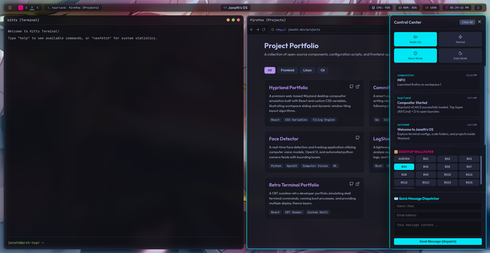

# 🖥️ Hyprland OS — Interactive Wayland Compositor Portfolio

[](https://react.dev/)
[](https://vite.dev/)
[](https://developer.mozilla.org/en-US/docs/Web/CSS)
[](https://archlinux.org/)
[](https://hyprland.org/)



An ultra-premium, interactive portfolio web application simulating the **Hyprland Wayland tiling window manager** environment. Modeled after popular Arch Linux desktop custom setups ("rices"), it showcases developer skills, coding files, and projects through a fully keyboard-driven desktop workspace environment.

> Live Demo: [https://quintusjonath-jemy.github.io/hyprland-portfolio/](https://quintusjonath-jemy.github.io/hyprland-portfolio/)

---

## 🚀 Key Features

*   🪟 **Dynamic Translucency & Glassmorphism**:
    Windows (Terminal, Neovim, and Firefox) use translucent base variables and `.glass` classes with `backdrop-filter: blur(16px) saturate(180%)` to allow the wallpaper to shine through while keeping text completely readable. Works seamlessly across Light and Dark themes.
*   🔄 **Auto-Wallpaper Rotator & Naming**:
    Features a built-in slideshow engine that auto-rotates the desktop wallpaper randomly every 30 seconds (complete with desktop notifications). Displays custom descriptive names (e.g. *Tokyo Neon*, *Synth Horizon*, *Deep Space*) for all 16 wallpapers in the SwayNC drawer.
*   🧩 **Dynamic Tiling Engine (Dwindle Split)**:
    Windows tile dynamically using binary space partitioning (BSP/Dwindle). Adding a window splits the workspace space horizontally or vertically with uniform window gaps and custom active gradient borders.
*   🎹 **Web Audio API Keyclick Synthesizer**:
    Includes built-in audio synthesis mimicking physical mechanical keyboard switch clicks when typing in the Terminal or Wofi launcher. Plays compositor dispatch tones on workspace slides.
*   🌌 **Drifting Aurora Wallpaper & Floating Canvas Particles**:
    Features an animated backdrop with huge, slow-moving CSS blur blobs ("auroras") combined with interactive particle canvas elements that pulse and float in response to cursor avoidance.
*   🚦 **Custom App Simulations**:
    *   `kitty` **Terminal**: Full interactive prompt responding to commands like `neofetch`, `about`, `skills`, `projects`, and a compositor executor `hyprctl dispatch exec <app>` to open windows!
    *   `neovim` **File Viewer**: A side explorer tree and editor tab line displaying profile configurations with custom color-coded syntax highlights.
    *   `firefox` **Browser**: A styled project cards showcase gallery with address search bars, category tab filters, and direct GitHub links.
*   📊 **Systemd Waybar & SwayNC Control Center**:
    *   A status Waybar tracking active window states, system clocks, calendar dropouts, and developer skill monitors (represented as CPU and RAM percentage metrics). Optimized with compact layouts for mobile.
    *   A slide-out drawer containing compositor notification feeds, custom quick settings (mute sound, fast physics speed, neon glow mode), and a direct contact form dispatching mail logs.

---

## ⌨️ Desktop Keyboard Shortcuts

Navigate this portfolio like a keyboard-centric Linux power user. Hold down **Alt** or **Meta (Cmd/Windows)** as the Super modifier:

| Keybind | Action |
| :--- | :--- |
| `Super + Enter` | Open Terminal (`kitty`) |
| `Super + Q` | Close Active Focused Window |
| `Super + V` | Toggle Tiling / Floating Mode for Focused Window |
| `Super + D` | Open Wofi App Search Launcher |
| `Super + [1 - 4]` | Slide viewports between Workspaces 1, 2, 3, or 4 |

*Note: You can also use the workspace module on the top-left Waybar or mouse drags to move floating window panels.*

---

## ⚙️ Tech Stack & Design Architecture

*   **Frontend Library**: [React.js](https://react.dev/) (Hooks, dynamic arrays state)
*   **Build Bundler**: [Vite](https://vite.dev/) (Hot Module Replacement)
*   **Styling**: Pure CSS Variables, Keyframes, Blur filters, Flexbox/Grid (Catppuccin & Tokyo Night Neon color tokens)
*   **Icons**: [Lucide React](https://github.com/lucide-javascript/lucide)
*   **Audio Synthesis**: Web Audio API `OscillatorNode`

---

## 🛠️ Local Development Installation

Get this project running locally on your workstation:

1.  **Clone the repository**:
    ```bash
    git clone https://github.com/quintusjonath-jemy/hyprland-portfolio.git
    cd hyprland-portfolio
    ```
2.  **Install project dependencies**:
    ```bash
    npm install
    ```
3.  **Start the local development server**:
    ```bash
    npm run dev
    ```
4.  **View output**:
    Open the browser to `http://localhost:5173/hyprland-portfolio/` (or the terminal's reported Vite local port).

---

## 📦 Production Deployment

To compile a highly optimized static bundle:

```bash
npm run build
```

This creates the build assets folder under `./dist`. You can deploy this easily to Vercel, Netlify, or configure the auto-deployment actions for GitHub Pages.
